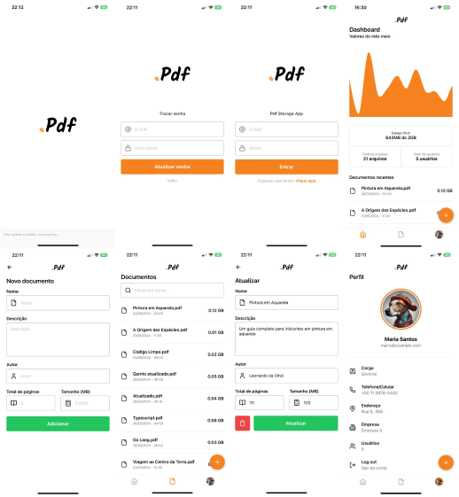

<h1 align="center">

</h1>
 
 
  

    
  

 
 
 

Project test to at FABRICAINFO, using Expo + Tailwind + Typescript

  

### Getting started

- In your terminal, run the steps:

> `pnpm install` **for install the modules**.

> `pnpm db`. **for running database with json-server :3000**.

> `pnpm start`. **for start app**.

## Features

Features used in the Project.

- **<a href="https://tailwindcss.com/" target="\_blank">TailwindCSS</a>**

- **<a href="https://www.typescriptlang.org/" target="_blank">TypeScript</a>**

- **<a href="https://lucide.dev/" target="_blank">Lucide Icons</a>**

### - NOTE

- All users has password **123456**, you see in `./src/database/db.json` file.

### - LICENSE

This project is licensed under the MIT License - see the <a href="https://opensource.org/licenses/MIT" target="_blank">LICENSE</a> page for details.
